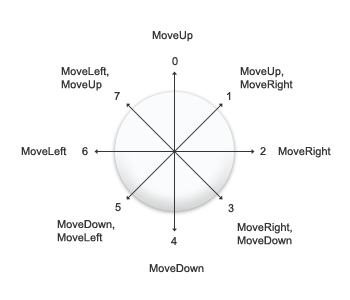

## SKJoystick
>SKJoystick is a retro-arcade joystick for SpriteKit

[](https://developer.apple.com/swift)
[](https://travis-ci.org/Alamofire/Alamofire)
[](https://developer.apple.com/iphone/index.action)
[](/LICENSE)

Available directions:

 

Shake:

 

**SKJoystick** is a library written in Swift to create a typical retro arcade joystick for SpriteKit.
Using a couple of texture , the famous [SKEase](https://github.com/craiggrummitt/ActionSwift3/tree/master/ActionSwift3) library to simulate the elastic bouncing animation. I've added also three button to have a complete controls to move your hero , jump, fire and made other actions..

- [Features](#features)
- [ToDo](#todo)
- [Requirements](#requirements)
- [Communication](#communication)
- [Installation](#installation)
- [Usage](#usage)
- [License](#license)


## Features

Creating a joystick node :

```
    - convenience init(texture: SKTexture?, color: SKColor = .clear, size: CGSize = CGSize(width:200.0,height:200.0),knob:String! = "blueKnob.png") {
      Initializes a new SKSpriteNode object aka our joystick.
```

- [x] 8 directions: up, down, left, righ and diagonals
- [x] change color, alpha and size
- [x] knowing in time real the directions and the releasing through delegate methods

## ToDo
- [x] new knob textures

## Requirements

- iOS 9.0+
- Xcode 9.2+
- Swift 4.0+

## Communication

- If you **found a bug**, open an issue.
- If you **have a feature request**, open an issue.
- If you **want to contribute**, submit a pull request.

## Installation

Add the source folder to your project and use it.

## Usage

```
class GameScene: SKScene, SKJoystickDelegate {
    var joyStick : SKJoystick!
    override func didMove(to view: SKView) {
        // Show joystick
        let joySize = CGSize(width:300,height:300)
        joyStick = SKJoystick.init(texture: nil, color: .clear, size: joySize, knob:"blueKnob.png")
        self.addChild(joyStick)
        joyStick.zPosition = 1
        joyStick.alpha = 0.5
        joyStick.position = CGPoint(x:self.frame.width/7,y:self.frame.height/4)
        joyStick.isUserInteractionEnabled = true
        joyStick.delegate = self
    }
```

Follow the example located to ```GameScene.swift``` to understand the delegate methods (really simple to use..), the property ```direction``` contain one of these constants:

```
enum Sense: Int {
    case UP = 0
    case UP_RIGHT = 1
    case RIGHT = 2
    case DOWN_RIGHT = 3
    case DOWN = 4
    case DOWN_LEFT = 5
    case LEFT = 6
    case UP_LEFT = 7
    case RELEASED = 8
}
```

## License
SKJoystick is released under the [MIT License](LICENSE)

